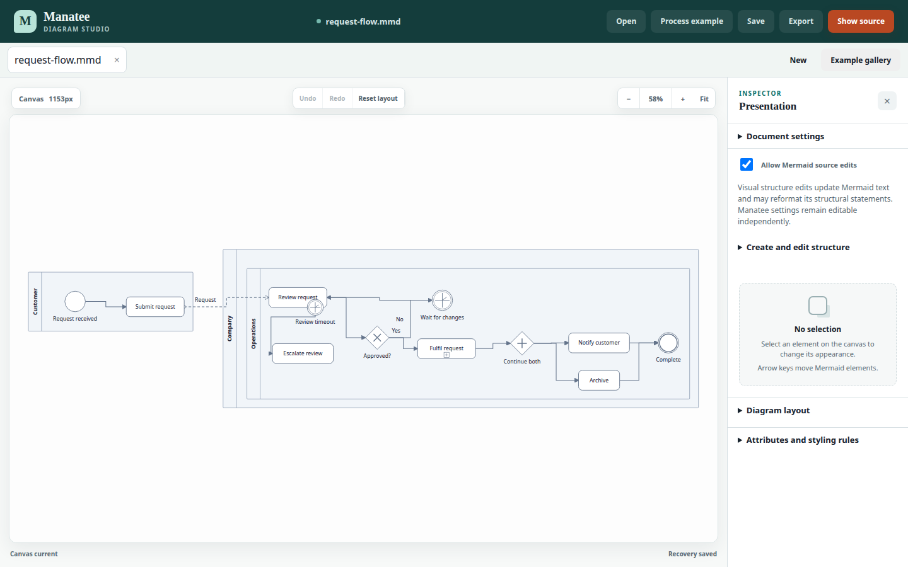

# Manatee

**A browser-based visual editor for portable Mermaid diagrams.** Manatee adds
direct manipulation, presentation styling, and common BPMN notation while
keeping the underlying Mermaid source readable and editable.

[Try Manatee](https://mlperrott.github.io/manatee/) ·
[Editor guide](docs/studio.md) ·
[Release and compatibility](docs/release.md)

[](https://github.com/mlperrott/manatee/actions/workflows/verify.yml)

[](https://mlperrott.github.io/manatee/)

## Why Manatee?

Mermaid is an excellent portable source format, but text alone is awkward when
you need to refine a diagram for a technical discussion or a management
presentation. Manatee lets you work visually without replacing that source with
an opaque canvas format.

Presentation choices are stored as versioned `manatee` YAML front matter.
Ordinary Mermaid viewers still show the authored structure; Manatee restores the
richer notation, styling, layout, and routing.

Everything runs in the browser. No account or backend is required, and recovery
copies remain in that browser until you download a portable file.

## What you can do

- **Author visually:** create and edit nodes, connections, labels, groups,
  swimlanes, and supported C4 details, or edit the Mermaid source directly.
- **Communicate processes:** apply tasks, start and end events, exclusive and
  parallel gateways, timer events, collapsed subprocesses, pools, lanes,
  sequence flows, and message flows.
- **Control layout and routing:** drag nodes and desktop containers, align
  connected nodes with smart snapping, lock connection endpoints to cardinal
  docks, reconnect endpoints, set exact positions and spacing, or return to
  automatic layout.
- **Build a visual language:** style individual elements or use typed attributes,
  classes, and ordered rules to apply consistent appearance.
- **Work safely:** keep multiple documents open, undo and redo changes, preserve
  the last valid preview while source is incomplete, and recover browser-local
  autosaves after a reload.
- **Move between tools:** open `.mmd` and `.mermaid` files, download portable
  source, export the rendered scene as SVG or high-resolution PNG, or copy a PNG
  to the clipboard.
- **Use desktop or mobile:** the responsive editor supports diagram selection,
  source editing, inspection, node movement, panning, and zooming on phones.

Manatee currently supports Mermaid 11.17.2 flowcharts with subgraphs, native
swimlanes, C4 context diagrams, and C4 container diagrams. Unsupported families
and deferred constructs are preserved where possible and reported with explicit
diagnostics. See the [release guide](docs/release.md) for the exact compatibility
boundary and checked limits.

## Try it

The fastest path is the [hosted editor](https://mlperrott.github.io/manatee/):

1. Choose **Add your first node** on a blank canvas, paste Mermaid source, or
   open **Examples**.
2. Label the starter node, add another, and connect them using the guided canvas
   actions. Select any element to change its label, shape, or appearance.
3. Use the arrow keys to select diagram elements. Hold Alt or Option while using
   an arrow key to move the selected element.
4. Use **Download .mmd** for a portable Mermaid file or **Export** for SVG or
   PNG. Browser recovery is separate and stays on this device.

The [editor guide](docs/studio.md) covers authoring scope, connection docking and
reconnection, styling rules, document recovery, and mobile controls.

## Project status and direction

Manatee is actively developed and pre-1.0. The public editor is continuously
deployed from `main` only after source, unit, production-build, desktop-browser,
and mobile-browser checks pass. The deployed site then runs its own smoke suite.

The project is intentionally **Mermaid-first**. Its direction is to make portable
text diagrams easier to author, arrange, and present while preserving a useful
fallback in ordinary Mermaid viewers. Common BPMN notation is for visual
communication; Manatee is not intended to provide BPMN XML interchange,
workflow execution, simulation, or full BPMN conformance.

## Develop locally

Requirements:

- Node.js 24 LTS, or Node.js 26 and newer
- pnpm 11.19.0

```sh
pnpm install
pnpm dev
```

The development application is served at <http://127.0.0.1:4173/>.

Run formatting, linting, architecture checks, type checking, unit tests, and a
production build with:

```sh
pnpm verify
```

Install the Playwright browser engines once, then run the browser suite:

```sh
pnpm exec playwright install chromium firefox webkit
pnpm test:browser
```

On Linux, WebKit may also need host libraries installed with
`pnpm exec playwright install-deps webkit`, which requires administrator access.
The `iphone` project uses WebKit, so installing Chromium alone is not sufficient.

## Architecture

Manatee is a client-only Solid application with framework-neutral document,
metadata, layout, persistence, and export modules. The central path is:

```text
Studio → DocumentSession → MermaidDocument → parse and normalize
       → resolve notation and styles → automatic layout → SVG scene
```

- `src/core` owns document sessions, workspaces, commands, and source-preserving
  metadata updates.
- `src/mermaid` owns Mermaid normalization, notation, layout, routing, and SVG
  rendering.
- `src/persistence` owns browser-local document recovery.
- `src/export` owns SVG, PNG, and clipboard output.
- `src/app` contains the editor UI and interactions.

[ADR-0002](docs/adr/0002-mermaid-authored-bpmn-notation.md) explains the
Mermaid-first product and architecture decision. The checked front-matter format
is documented by the [version-one JSON Schema](docs/schema/manatee-v1.schema.json).

## Documentation and support

- [Editor authoring and examples](docs/studio.md)
- [Release scope, browser support, and export compatibility](docs/release.md)
- [Project language and domain model](CONTEXT.md)
- [Architecture decisions](docs/adr/)
- [README research and writing rationale](docs/research/readme-best-practices.md)

Use [GitHub Issues](https://github.com/mlperrott/manatee/issues) for bugs and
design proposals. The repository does not yet have a contribution guide.

## License

This repository does not currently include an open-source license. Its source is
publicly visible, but no permission to copy, modify, or redistribute it has been
granted.
