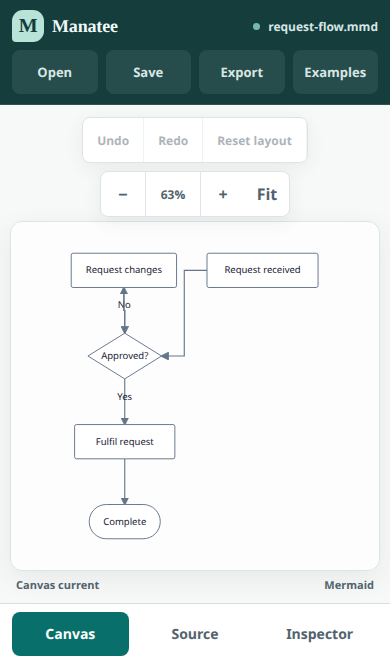
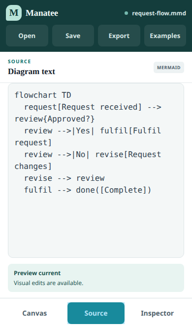

# Studio UX review — 13 September 2026

> Historical review of the superseded dual-format release. BPMN XML findings below no longer describe the product; current mobile requirements are in [the release guide](release.md).

Reviewed the live [GitHub Pages Studio](https://mlperrott.github.io/manatee/) and implemented the corrections in the existing Solid application. The review covers first use, navigation, canvas interaction, source editing, inspector actions, file import/save, SVG/PNG export, feedback, error recovery, accessibility, responsive layout, and desktop regressions.

The previous mobile exclusion in ADR-0001 is expanded by the requested iPhone workflow. Document semantics, format adapters, portable source preservation, and the existing GitHub Pages architecture remain the same.

## Findings and corrections

| Priority | Finding | Correction |
| --- | --- | --- |
| Critical | The live site forced a 960px minimum layout. A 390px iPhone viewport reported an approximately 961px layout viewport, shrinking the entire interface. | Removed the desktop minimum. Responsive layouts use the real viewport, with no horizontal page overflow at 320, 375, 390, 430, or 844px. |
| High | Source, inspector, and canvas competed for width on phones. | Separate Canvas, Source, and Inspector views with persistent bottom navigation. Selection and source survive view changes. Desktop retains simultaneous panels. |
| High | The initial Mermaid diagram extended offscreen, and CSS transforms retained the original scroll dimensions. | A vertical example on phones, automatic fit, an explicit Fit control, and a drawing box whose dimensions match the displayed scale. Imported semantic source is never rewritten for orientation. Zoomed diagrams remain scrollable. |
| High | Mouse-oriented pointer handling could confuse touch scrolling with element movement and retained cancelled drags. | Touch taps select; native swipes scroll and pinch zoom stays enabled. Cancelled gestures clear their state. Inspector arrow buttons provide precise Mermaid moves. Desktop dragging and keyboard movement remain available. |
| High | Small controls were hard to tap; crowded top actions clipped. | At least 44×44 CSS-pixel primary mobile controls. Open, Save, Export, and Examples have dedicated positions. Example choices move into a menu. Long filenames truncate without altering downloads. |
| High | iPhone source fields used 12px text and enabled automatic text transformations. | 16px source and text inputs, disabled autocorrection/capitalization, and a scrollable editor with reachable diagnostics. Source entry waits for the initial document to open, preventing a startup race discovered in WebKit. |
| High | Fixed viewport height did not account for browser chrome, the keyboard, or safe areas. | Dynamic viewport sizing, visual viewport resize handling, and safe-area padding for the notch and home indicator. Portrait, landscape, and a reduced-height editing viewport are covered. |
| High | BPMN's creation palette intercepted taps over the fitted process on phones. | Hide the mobile creation palette and context pad, which expose semantic authoring outside the supported presentation workflow. Selection, appearance changes, fit, export, and bpmn.io attribution remain available. |
| Medium | Export options were awkward to reach in landscape; menus lacked Escape/outside-tap dismissal. | Bounded scrolling menus, a compact landscape export layout, outside-tap dismissal, and Escape with focus returned to the summary. |
| High | Saving immediately after typing could download the previous parsed source. | Save uses the latest editor text, and image export waits until the preview corresponds to it. |
| Medium | Save feedback was only rendered inside the closed Export menu. | A visible, dismissible status message confirms Save and export outcomes. |
| Medium | Recovery notices exceeded narrow screens. | Width-bounded notices with wrapped filenames and full-size recovery actions. Invalid source recovery retains the last valid preview. |
| Medium | Closing the desktop inspector left a reserved empty column. | Grid tracks now follow the actual open panels. Regression coverage verifies that the canvas reclaims the space. |
| Medium | Primary button contrast, muted text, and format badges needed improvement; select/summary focus was omitted. | Darkened the accent and muted text, corrected badge contrast, extended visible focus styling, and preserved reduced-motion handling. |

## Verification

- `pnpm verify`: formatting, lint, dependency boundaries, type checking, 84 unit/integration tests, and the production build pass.
- 42 desktop browser tests pass across Chromium, Firefox, and WebKit. Three deployed-only tests are intentionally skipped on the development server.
- 20 mobile browser tests pass in iPhone WebKit emulation and touch-enabled Chromium, against the production build served under `/manatee/`; the initial 18-case suite also passed against development. The complete suite is included in CI.
- Mobile coverage includes viewport containment, control dimensions, source editing, selection, moving, styling, undo, PNG/SVG download, portable file import/save, invalid-source recovery, long filenames, rotation, reduced viewport height, and cancelled touch gestures.
- Automated accessibility checks use axe-core WCAG 2 A/AA and WCAG 2.1 AA rules on the desktop and mobile canvas, source, inspector, and export views. The initial scan identified muted-text and badge contrast defects; the final scan verifies the corrections. Automated checks do not constitute accessibility certification.
- CI now includes both mobile projects before deployment and an iPhone workflow smoke suite against the actual GitHub Pages URL after deployment.

## Practical limits and follow-up

This review uses browser engines and iPhone emulation, not a physical iPhone. Real-device checks remain appropriate for the iOS Files sheet, download/clipboard permission UI, software keyboard animation, hardware safe areas, native pinch gestures, and VoiceOver. The reduced-height test verifies layout resilience rather than pretending to open an actual iOS keyboard.

Fit provides an overview; long or dense diagrams still require zooming and scrolling to read labels. Source remains the portable textual representation. BPMN Fit can be used after rotation, and complex BPMN geometry authoring remains better suited to a larger screen.

The existing production entry is approximately 607KB gzipped, with separate layout workers and a lazy BPMN renderer. Cold starts on slow mobile networks are a follow-up performance opportunity; desktop render-budget tests do not establish performance on low-end phones.

Autosave remains browser-local. Save produces a portable file; browser data clearing or switching browsers does not transfer that autosave. The review does not expand Manatee into a cloud document library or full semantic BPMN authoring tool.

### Existing Firefox recovery instability

An additional production regression run encountered an intermittent Firefox content-process crash (`signal 11`) during invalid-autosave recovery. The same unmodified browser test also reproduces the crash against the unchanged live site, before this revision is published. This establishes that it is not introduced by the mobile changes, but does not establish whether its root cause is Firefox, the local host, or the existing recovery implementation. The normal 42-test desktop run passed; this additional intermittent finding remains a follow-up. No tests or release checks were disabled.

Reproduction: `MANATEE_BASE_URL=https://mlperrott.github.io/manatee/ pnpm exec playwright test tests/browser/app-shell.spec.ts --project=firefox --grep 'recovers invalid autosave' --workers=1 --repeat-each=5`.
